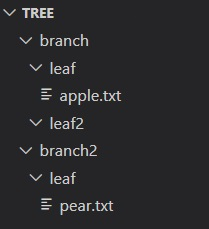

# Esercitazioni sulla command line

Provate a svolgere in autonomia il seguente esercizio sull'uso della command line. Se necessario consultate le Soluzioni

Si consiglia di verificare che i passaggi siano stati eseguiti correttamente sfruttando `ls` e `pwd`.
 
Approfittate della struttura della directory generata per prenderci mano con il comando `cd`, le path assolute e relative, e i simboli `.`, `..`, `~` e `-`.

Ad ogni step cercate di avere un immagine chiara della struttura delle cartelle e il loro contenuto, e come le vostre modifiche li vanno a influenzare.

## Esercizio

1. Aprite il terminale (WSL su windows) e assicuratevi di essere nella Home directory


<details><summary>Soluzione</summary>

Usiamo il comando `pwd` per vedere qual è la cartella di lavoro
```bash
$ pwd
/home/$USER
```
> La Home directory sarà `/home/$USER` su Ubuntu e `/Users/$USER` su Mac

Se non ci troviamo nella home, navighiamoci usando il comando `cd` senza opzioni o argomenti

```bash
$ cd
```
</details>

2. Create una cartella di nome `parent` e navigate al suo interno

<details><summary>Soluzione</summary>

Usiamo il comando `mkdir` per creare la cartella 
```bash
$ mkdir parent
```
Navighiamo al suo interno con il comando `cd`

```bash
$ cd parent
```

Verifichiamo di essere al suo interno con il comando `pwd`

```bash
$ pwd
/home/$USER/parent
```

</details>

3. Create dentro a parent una cartella `child` e navigate al suo interno

<details><summary>Soluzione</summary>

Usiamo il comando `mkdir` per creare la cartella 
```bash
$ mkdir child
```
Navighiamo al suo interno con il comando `cd`

```bash
$ cd child
```

Verifichiamo di essere al suo interno con il comando `pwd`

```bash
$ pwd
/home/$USER/parent/child
```

</details>

4. Tornate nella home e da lì create una cartella `sister` dentro la cartella `parent`. Verificate che ci siano due cartelle nella directory `parent`.

<details><summary>Soluzione</summary>

Torniamo nella home con `cd`

```bash
cd
```

Usiamo il comando `mkdir` per creare la cartella, specificando la path relativa 
```bash
$ mkdir parent/sister
```

Usiamo il comando `ls` per vedere che le cartelle sono state create

```bash
$ ls parent/
child sister
```

</details>

5. Create nella cartella `parent` la cartella `brother` e la sua sottocartella `grandchild` in un singolo comando

<details><summary>Soluzione</summary>

Usiamo il comando `mkdir` con l'opzione `-p` per creare la cartella 
```bash
$ mkdir -p parent/brother/grandchild
```

</details>

6. Tornate nella cartella `child` e create il file `my_file`

<details><summary>Soluzione</summary>

Usiamo il comando `cd` per tornare in `child`. 

Se non ci siamo spostati dopo essere tornati nella home possiamo usare

```bash
$ cd -
```

altrimenti navighiamo specificando il path relativo o assoluto

```bash
$ cd /home/$USER/parent/child/
```

Verifichiamo di essere nella cartella giusta con il comando `pwd`

```bash
$ pwd
/home/$USER/parent/child
```

Creiamo il file con il comando `touch`
```bash
$ touch my_file
```

</details>

7. Copiate il file `my_file` dalla cartella `child` alla cartella `parent`

<details><summary>Soluzione</summary>

Usiamo il comando `cp` per copiare il file 
```bash
$ cp my_file ..
```

> Trovandoci nella cartella `child` possiamo usare i path relativi per fare la copia. La path relativa alla cartella `parent` sarà semplicemente `..`.
> Se così non fosse, possiamo sempre usare i path assoluti, che sono sempre inequivocabili
> ```bash
> $ cp /home/$USER/parent/child/my_file /home/$USER/parent/
> ```

</details>

8. Copiate la cartella `grandchild` dalla cartella `brother` alla cartella `child`. Verificate il contenuto di child per controllare la presenza di una sottocartella `grandchild` e il file `my_file`

<details><summary>Soluzione</summary>

Usiamo il comando `cp` con l'opzione `-r` per copiare la cartella 
```bash
$ cp -r ../brother/grandchild .
```

Usiamo il comando `ls` per verificarne il contenuto

```bash
$ ls
grandchild my_file
```

</details>

9. Spostate `my_file` dalla cartella `child` alla cartella `grandchild`

<details><summary>Soluzione</summary>

Usiamo il comando `mv` per spostare il file 
```bash
$ mv my_file grandchild/
```

Usiamo il comando `ls` per verificare lo spostamento

```bash
$ ls grandchild/
my_file
```

</details>

10. Rinominate il file `my_file` nella cartella `parent` in `parent_file`

<details><summary>Soluzione</summary>

Il comando `mv` può essere usato per rinominare i file
```bash
$ mv /home/$USER/parent/my_file /home/$USER/parent/parent_file
```

> Possiamo sempre usare le path relative al cartella in cui ci troviamo attualmente (che possiamo individuare con `pwd`)

</details>

11. Spostate la cartella `grandchild` e il suo contenuto dalla cartella `child` alla cartella `sister`

<details><summary>Soluzione</summary>

Usiamo il comando `mv` per spostare la cartella 
```bash
$ mv grandchild/ ../sister/
```

</details>

12. Eliminate la cartella `child`

<details><summary>Soluzione</summary>

Usiamo il comando `rmdir` per eliminare la cartella `child` ora vuota

```bash
$ rmdir home/$USRE/parent/child
```

</details>

13. Eliminate il file `parent_file`

<details><summary>Soluzione</summary>

Usiamo il comando `rm` per eliminare il file 
```bash
$ rm /home/$USER/parent/parent_file
```

</details>

14.  Eliminate la cartella `sister`

<details><summary>Soluzione</summary>

Il comando `rmdir` darà errore perché la cartella non è vuota

```bash
$ rmdir sister/
rmdir: failed to remove 'sister/': Directory not empty
```

Il comando `rm` senza opzioni darà errore perché `sister` è una cartella e non un file

```bash
$ rm sister/
rm: cannot remove 'sister/': Is a directory
```

Usiamo il comando `rm -rf` per eliminare la cartella `sister` che non è vuota

```bash
$ rm -rf /home/$USER/parent/sister
```

</details>

## Provate voi

Eseguite i comandi necessari per creare una struttura di cartelle come la seguente nella vostra home directory:



Prendete dimestichezza con il navigare tra le cartelle, muovere, copiare e rimuovere file e cartelle. Prestate attenzione a eventuali errori e all'effetto di ogni vostra azione.
